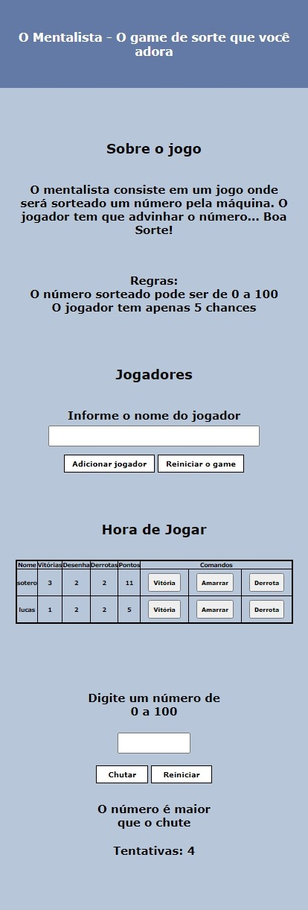
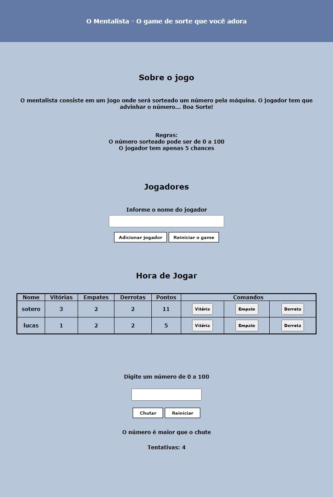
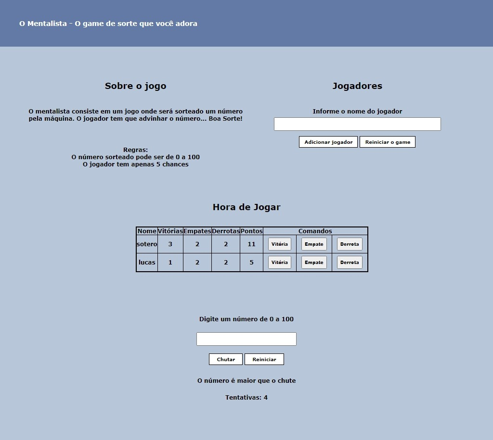

<h2>Jogo: O Mentalista</h2>

<section>
  
  <h3 align="center">Versão mobile</h3>
  
  

  
</section>

<section>
  
  <h3 align="center">Versão tablet</h3>
  
  

  
</section>

<section>
  
  <h3 align="center">Versão desktop</h3>
  
  
  
  
</section>

<h2>Sobre</h2>

<h4>"Um projeto totalmente autoral, criado para se tornar um jogo divertido."</h4>

<h2>Motivo</h2>

Iniciei esse projeto por conta de querer agregar ao meu portfólio e para pôr em prática meu aprendizado em JS.

<h2>Objetivos</h2>

<ol>
    <li>O site tem a função de ser um jogo de tentativa e erro, totalmente gratuito</li>
    <li>O site pode ser aberto nas principais telas do mercado: mobile, tablet e desktop</li>
</ol>

<h2>Funcionalidades</h2>

<ul>
    <li>Nome campo de 'Jogadores', os usuários adicionarão seu nomes ou nicknames para iniciar o jogo</li>
    <li>O botão 'Adicionar jogador' agrega um jogador a tabela, já o botão 'Reiniciar o game' remove todos os jogadores da tabela.</li>
    <li>Após adicinado os jogadores, eles aparecerão na tabela localizada no campo 'Hora de Jogar', juntamente com seus dados.</li>
    <li>Os botões 'Vitória', 'Derrota' e 'Empate' servem para adicinar valores aos seus respectivos campos, em seguida somando os pontos, sendo vitória: 3 pontos, empate: 1 ponto e derrota: 0 pontos</li>
    <li>O botão 'Chutar' serve para o jogador tentar acertar o número aleatório gerado, cujo o jogador tem 5 chances de acertar, já o botão 'Reiniciar' serve para o jogador reiniciar suas tentativas e gerar um novo número aleatório</li>
</ul>

<h2>Instalação</h2>
  
<h5>$ git clone https://github.com/lucassoteroo/JogoMentalista.git</h5> 

<h2>Contrução</h2>

